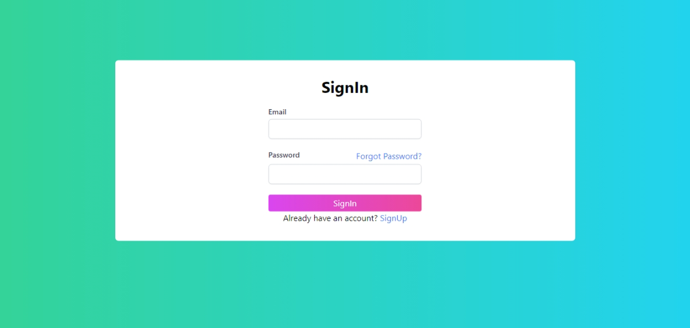

# Authenticate with MERN Stack 

## Description
This is a simple MERN stack application that allows users to authenticate with a username and password. The application uses React for the front end, Node.js and Express for the back end, and MongoDB for the database. The application uses JWT for authentication and bcrypt for password hashing.

## Installation
1. Clone the repository
```bash
git clone https://github.com/AbdurRaahimm/AuthInMERN.git
```
2. Go to the project directory
```bash
cd AuthInMERN
```
2. Install dependencies for server and client
```bash
npm install
cd client
npm install
```
3. Create a .env file in the root directory and add the following environment variables
```bash
JWT_SECRET = jwt secret
DB_URI = mongodb uri
EMAIL = smtp email
PASSWORD = smtp password
```

4. Start the application server and client
```bash
npm start
cd client
npm run dev
```

## Usage
1. Register a new user by clicking on the register link
2. Login with the registered user
3. Logout by clicking on the logout link
4. View the profile page by clicking on the profile link

## Screenshots
1. Register page


2. Login page



3. home page


3. Profile page


4. Forgot password page


5. Reset password page


## Features
1. Register a new user
2. Login with a registered user
3. Logout
4. View the profile page
5. Protected routes
6. Password hashing
7. JWT authentication
8. Forgot password
9. Reset password
10. Profile picture upload

## Technologies
1. React (vite)
2. Node.js
3. Express
4. MongoDB
5. JWT
6. Bcrypt
7. Nodemailer
8. Tailwind CSS
9. React Router
10. react-toastify
11. multer

